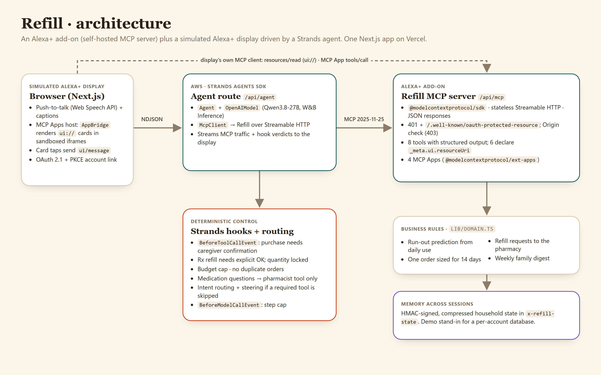

# Refill

**An Alexa+ add-on that keeps an aging parent's home stocked, for the family caregiver who lives too far away to just drop by.**

Refill predicts when supplies and prescriptions at the parent's home will run out and drafts one consolidated order for the caregiver to confirm with a tap. Prescription refills go to the pharmacy as requests, medication questions go to a pharmacist, and the family gets a weekly digest. It is a self-hosted **MCP server** (the open standard behind Alexa+ integrations) with **MCP Apps** cards. Here it is demoed in a simulated Alexa+ display driven by a **Strands Agents** agent.

- **Live demo:** https://refill-delta-six.vercel.app (no sign-up; click "Link Refill account", then "Allow")
- **Pitch deck:** https://refill-delta-six.vercel.app/slides.html
- **MCP endpoint:** `https://refill-delta-six.vercel.app/api/mcp` (OAuth-protected; see [Connect an MCP client](#connect-an-mcp-client))

Built new during the Amazon "Build, Ship, Shape" hackathon submission window (from Aug 31, 2026). Track: **Alexa+**. Mini challenge: **AWS Builder** (Strands Agents SDK).



## The problem

**63 million Americans are family caregivers**, nearly 50% more than in 2015. **One in every four adults is a caregiver**, **seven in ten family caregivers are employed**, and **half report a negative financial impact** from caregiving ([AARP and National Alliance for Caregiving, *Caregiving in the US 2025*, July 24, 2025](https://www.aarp.org/pri/topics/ltss/family-caregiving/caregiving-in-the-us-2025/)).

When the parent lives in another city, much of that work is logistics: noticing the briefs are almost gone, remembering which prescription is due, avoiding a second order of something a brother already bought, keeping everyone in the loop. Getting any of it wrong means a parent without supplies or medication.

Our demo household is fictional: Maya in Seattle, her dad Walter (81) in Tucson, her brother Dan nearby, a neighbor named Rosa.

## Our solution

Maya talks to Refill on her Alexa+ display:

1. **"What's running low at Dad's?"** A running-low timeline (an MCP App) shows days left for each item, predicted from daily use, and what is already on order or being refilled.
2. **"Order what he needs, and refill his lisinopril."** Refill drafts **one** order for everything non-prescription that runs out within a week. The order is sized for two weeks, checked against the monthly budget, and skips anything already on order. The due prescription appears as a separate approval.
3. **She taps Place order.** Nothing is bought until she confirms.
4. **She approves the refill.** It is a request to the pharmacy, never a purchase, and the quantity always comes from the prescription.
5. **"Can he take an extra lisinopril?"** Refill gives no medical advice; the question is forwarded to a pharmacist who calls her back.
6. **Three days later**, the order has arrived and Dan picked up the refill. Refill remembers the household across sessions and sends the family a **weekly digest**.

The caregiver stays in charge of every purchase and every medication decision. Refill removes the tracking, the arithmetic, and the group-text chasing.

**Beyond the hackathon:** a caregiver subscription, plus retailer and pharmacy partnerships (one consolidated order, fewer missed refills). The next step on Alexa+ is checkout through Partner Wallet.

## How we use Amazon's tech: Alexa+

Real Alexa+ deployment is currently limited to select partners, so we built exactly what the track allows: a **self-hosted MCP server** that follows the Alexa+ MCP Toolkit requirements, plus a **simulated Alexa+ experience** in a web app.

| Alexa+ / MCP requirement | Where |
| --- | --- |
| MCP spec **2025-11-25**, **Streamable HTTP** (stateless, JSON responses) via `@modelcontextprotocol/sdk` | `app/api/mcp/route.ts` |
| 8 tools with structured output: `get_supply_status`, `draft_refill_order`, `place_order`, `request_prescription_refill`, `ask_pharmacist`, `update_supply`, `send_family_digest`, `simulate_days` (demo clock only) | `lib/mcp/server.ts` |
| **MCP Apps** (`@modelcontextprotocol/ext-apps`): 4 `ui://` resources (running-low timeline, checkout, pharmacist handoff, family digest). Tools declare `_meta.ui.resourceUri`; checkout buttons confirm through `ui/message` | `lib/mcp/ui.ts` |
| Account linking: **OAuth 2.1** authorization code + **PKCE S256**, `resource` parameter, refresh tokens | `app/oauth/authorize/page.tsx`, `app/api/oauth/*`, `lib/oauth.ts` |
| Unauthenticated calls return **401** with `WWW-Authenticate: Bearer resource_metadata=…`; **Protected Resource Metadata** and authorization server metadata are published | `app/.well-known/*` |
| Origin validation (**403** for foreign origins) | `app/api/mcp/route.ts` |
| Fast tool round trips (tools are deterministic code; ~20–250 ms locally) | `lib/domain.ts` |
| **Agent Skill** documenting how any agent should use the add-on | `skills/refill-caregiver/SKILL.md` |
| **Simulated Alexa+ display**: push-to-talk (Web Speech API), spoken replies, captions, MCP Apps host (`AppBridge` in a sandboxed iframe), live MCP activity panel | `app/page.tsx`, `components/AppCard.tsx`, `lib/client/*` |

**Memory across sessions:** the household state is an HMAC-signed, compressed blob carried in an `x-refill-state` header and stored by the display. It is tamper-proof and needs no database or new account for the demo. In production it becomes a per-account store (e.g. DynamoDB).

## AWS: Strands Agents SDK

The display's assistant is a **Strands Agents TypeScript SDK** agent (`lib/agent.ts`, served by `app/api/agent/route.ts`):

- **`Agent` + `McpClient`**: the agent reaches Refill only through its MCP server over Streamable HTTP, exactly like any Alexa+ client would. Tools come from `tools/list`; nothing is hard-wired.
- **`OpenAIModel`**: Qwen3.8-27B through an OpenAI-compatible endpoint (W&B Inference). Strands is model-agnostic, so moving to Amazon Bedrock is a provider swap with the same tools and hooks. We did not use paid AWS services.
- **`BeforeToolCallEvent` hooks** enforce the rules in code:
  - `caregiver-confirms-purchase`: `place_order` only for a draft Maya has seen and confirmed in her latest message
  - `rx-needs-explicit-ok` and `rx-quantity-locked`: refills need an explicit yes naming the medicine, and the model can't set a quantity
  - `monthly-budget-cap` and `no-duplicate-orders`
  - `no-medical-advice`: medication questions see only the `ask_pharmacist` tool (`McpClient` tool filters) and can't trigger anything else
- **`BeforeModelCallEvent`**: step cap per request.
- **Intent routing and steering:** deterministic code names the tool a request requires. If the model replies without executing it, the agent is steered once to call it. Executed calls are verified from the MCP traffic, not from the model's text.
- Every MCP request and every hook verdict (ROUTED / ALLOWED / BLOCKED / STEERED) streams to the display's activity panel as NDJSON.

The MCP server repeats the critical rules (budget, duplicates, quantity lock) in `lib/domain.ts`, so they hold for any client, not just our agent.

## Try it

1. Open https://refill-delta-six.vercel.app, click **Link Refill account**, then **Allow** (demo OAuth; no personal data).
2. Say or type **"What's running low at Dad's?"**
3. **"Order what he needs, and refill his lisinopril."** Then tap **Place order** and **Request refill** on the card.
4. **"Can he take an extra lisinopril if his blood pressure is high?"**
5. Click **⏩ 3 days later**, then **"Send the family this week's update."**
6. **Reset demo** starts over. Agent requests are rate limited per IP (in-memory, per serverless instance).

## Run locally

Requirements: Node 22+, pnpm, and any OpenAI-compatible chat model with tool calling.

```bash
pnpm install
cp .env.example .env.local   # then fill in the values
pnpm build && pnpm start      # http://localhost:3000
```

`.env.local`:

```
OPENAI_BASE_URL=https://api.inference.wandb.ai/v1
OPENAI_API_KEY=...
OPENAI_MODEL=Qwen/Qwen3.8-27B
REFILL_SECRET=<any long random string>
```

Checks:

```bash
BASE=http://localhost:3000 node scripts/smoke-mcp.mjs     # auth, PKCE, MCP 2025-11-25, MCP Apps, business rules
BASE=http://localhost:3000 node scripts/smoke-agent.mjs   # the demo conversation through the Strands agent
```

### Connect an MCP client

Point any MCP client that supports OAuth at `/api/mcp`. It discovers `/.well-known/oauth-protected-resource`, runs the authorization code + PKCE flow against `/oauth/authorize` and `/api/oauth/token`, then calls tools. Clients that render MCP Apps show the cards. To keep household state between calls, send back the `x-refill-state` response header on the next request.

## Stack

Next.js 16 · React 19 · TypeScript · Strands Agents SDK (TypeScript) · `@modelcontextprotocol/sdk` · `@modelcontextprotocol/ext-apps` · zod · Tailwind CSS · Vercel. Narration for the demo video: ElevenLabs.

See [FRICTION_LOG.md](FRICTION_LOG.md) for the problems we hit and our suggestions. Asset credits are in [docs/CREDITS.md](docs/CREDITS.md).

**Disclosures:** all people, products, the retailer ("Corner Cart") and the pharmacy ("Desert Bloom Pharmacy") are fictional, and all payments and pharmacy requests are simulated. Refill does not give medical advice. Built with Claude Code as a coding assistant.

## License

TBD before submission.
